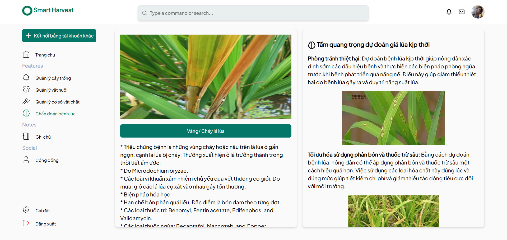

# SMART HARVEST
Smart Harvest is a solution for farmers in Vietnam. The solution's main target is in line with the second goal of the UN Sustainable Development Goals. The main features are:

- Field management
- Disease classification
- Weather forecast
- Agriculture news

## Technical stack
- Mobile app: Flutter, Dart
- Frontend: NextJS
- Backend: NodeJS, Flask
- Database: PostgreSQL, MongoDB, Firebase
- Deep learning: TensorFlow
- Cloud: Google Cloud Platform

## Target Devices
- Android : APK File in `Release`
- Web : http://congnong.edubox.io.vn (declare)

## Architecture diagram

## Model 
##### Rice Leaf Diseases Classification
- Dataset: https://www.kaggle.com/datasets/loki4514/rice-leaf-diseases-detection
- Notebook: https://www.kaggle.com/code/venomsnaker/rice-leaf-diseases-classification
- Reference Notebook: https://www.kaggle.com/datasets/shrupyag001/philippines-rice-diseases
Comments

## Features and Demo
### Web App
|  |  |
| :----------------------------------------------------------: | :------------------------------------------------------------: |
| Landing Page                                                | Home Page                                                     |

|  |  |
| :--------------------------------------------------------------------------: | :---------------------------------------------------------------------: |
| Diseases Prediction Page                                                    | Note and Planning Page                                                 |

### Mobile App

|  |  |  |  |
| :---------------------------------------------------------------: | :------------------------------------------------------------------: | :----------------------------------------------------------------------------------: | :-------------------------------------------------------------------: |
| Market Nearest                                                   | Note and Planning                                                   | Diseases Prediction Page                                                            | Predict Results                                                      |

## TODO
- [ ] Add more features.
- [ ] Implement more models for diseases classification.
- [ ] Implement on Docker.

